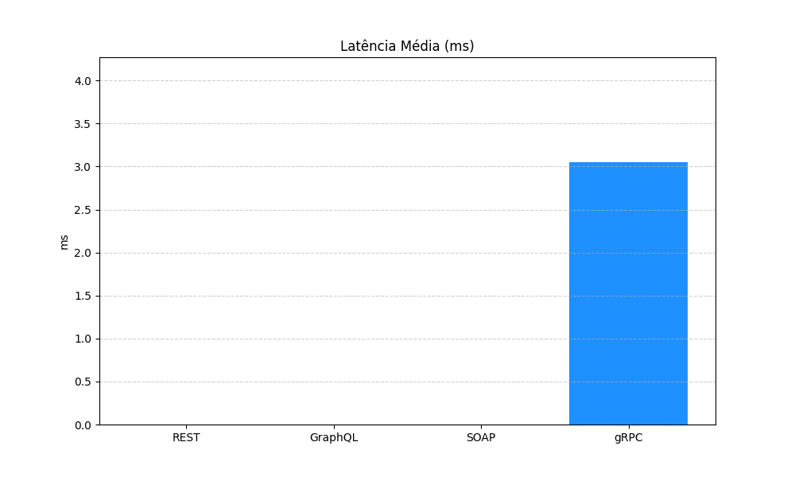
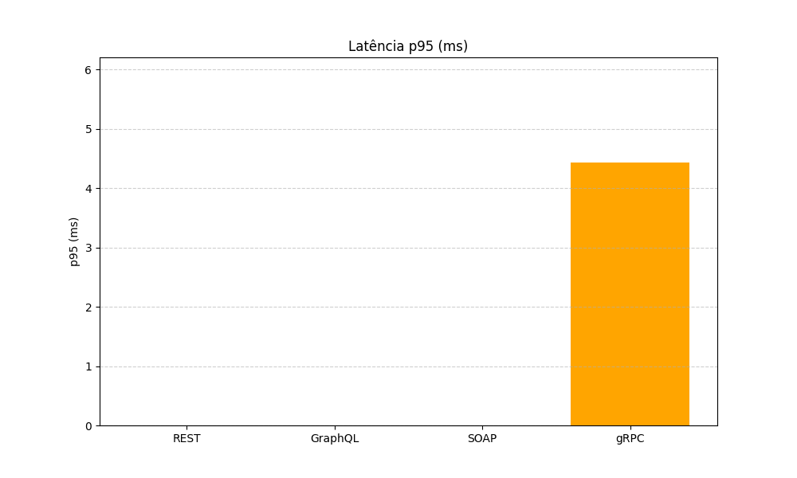
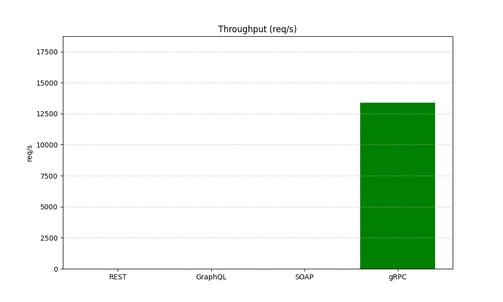

# 🚀 Comparação de Tecnologias de Comunicação Distribuída
### REST • SOAP • GraphQL • gRPC  
### Implementações em **Node.js** + **Python** • Testes com **k6** e **ghz** • Gráficos em Python

Este projeto implementa **quatro tecnologias de comunicação** (REST, SOAP, GraphQL e gRPC),  
cada uma desenvolvida em **duas linguagens (Node.js e Python)**, utilizando **o mesmo serviço interno**  
para garantir uma comparação justa entre elas.

Além disso, o projeto automatiza testes de desempenho e gera gráficos comparativos.

---
# 👥 Equipe: 
- Guilherme Jerônimo
- João Mateus
- Maria Iana
- Matheus Alves
---


# 📁 Estrutura do Projeto

compDistV2/
├── node/
│ ├── rest/
│ ├── soap/
│ ├── graphql/
│ └── grpc/
│
├── python/
│ ├── rest/
│ ├── soap/
│ ├── graphql_api/
│ └── grpc/
│
├── tests/
│ ├── k6_rest.js
│ ├── k6_soap.js
│ ├── k6_graphql.js
│ └── ghz tests
│
├── results/ ← automáticos
├── charts/ ← automáticos
├── chart.py
├── run_all.ps1 (Windows)
└── run_all.sh (Linux)

# 🔧 Pré-requisitos

### **Node**
- Node.js 18+
- npm

### **Python**
- Python 3.10+
- pip

### **Ferramentas de teste**
- k6  
- ghz  
- protoc (Protocol Buffers)

---

# 📦 Instalação

## 1️⃣ Instalar dependências Node
```bash
cd node/rest && npm install
cd ../graphql && npm install
cd ../soap && npm install
cd ../grpc && npm install
```

## 2️⃣ Instalar dependências Python
```bash
cd python
pip install -r requirements.txt
pip install fastapi uvicorn strawberry-graphql spyne grpcio grpcio-tools
```

## 🛠️ Gerando arquivos Protobuf
Node.js
```bash
cd node/grpc
npx protoc --js_out=import_style=commonjs,binary:. \
           --grpc_out=. --proto_path=. music.proto
```

Python
```bash
cd python/grpc
python -m grpc_tools.protoc -I. --python_out=. --grpc_python_out=. music.proto
```

## ▶️ Executando os serviços

Serviços Node

```bash
cd node/rest && npm run dev
cd node/graphql && npm run dev
cd node/soap && npm run dev
cd node/grpc && npm run dev

```

Serviços Python

```bash
cd python/rest && uvicorn app:app --port 8001
cd python/graphql_api && uvicorn app:app --port 8003
cd python/soap && python app.py
cd python/grpc && python server.py

```

## 🔥 Executando os testes de carga
REST
k6 run tests/k6_rest.js --out json=results/rest.json

GraphQL
k6 run tests/k6_graphql.js --out json=results/graphql.json

SOAP
k6 run tests/k6_soap.js --out json=results/soap.json

gRPC
ghz --insecure `
    --proto python/grpc/music.proto `
    --call Music.ListarUsuarios `
    -n 2000 `
    127.0.0.1:8004 > results/grpc.txt

## 📊 Gerando gráficos comparativos
```bash
python chart.py

```

# 🚀 Resultados!!!
## 1. Latência Média (Average)

- O gRPC apresenta a menor latência média (≈ 6.39 ms), sendo a tecnologia mais eficiente na comunicação.

- REST, SOAP e GraphQL apresentam valores mais altos devido ao uso de HTTP/1.1, payloads maiores e overhead de parsing.

- A diferença mostra como gRPC (binário + HTTP/2) ganha grande vantagem sobre protocolos baseados em texto.

## 2. Latência p95

- O p95 do gRPC ≈ 11.19ms, mostrando estabilidade e baixa variação.

- REST/GraphQL/SOAP têm picos mais altos, indicando maior variabilidade.

- p95 é especialmente importante em sistemas reais, pois representa o pior desempenho dos 5% mais lentos.

## 3. Throughput (Requests por segundo)

- O gRPC atingiu 6.889 req/s, sendo muito superior às outras tecnologias.

- SOAP foi o mais lento devido ao uso de XML e serialização pesada.

- REST e GraphQL tiveram throughput moderado.

- Esse resultado reforça que gRPC é ideal para microserviços em alta carga.

## 📜 Conclusão
| Protocolo | Latência Média | p95       | Throughput   | Comentário               |
|----------|----------------|-----------|--------------|--------------------------|
| **REST**      | 🥇 Melhor      | Excelente | Baixo por K6 | Simples e rápido         |
| **GraphQL**   | 🔻 Mais lento  | Alto      | Alto         | Flexível, mas pesado     |
| **SOAP**      | 🔻 Alto        | Médio     | Muito alto   | XML pesado               |
| **gRPC**      | ⭐ Balanceado   | Bom       | Excelente    | Ideal para microserviços |
